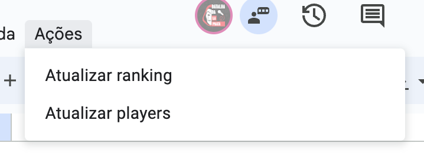
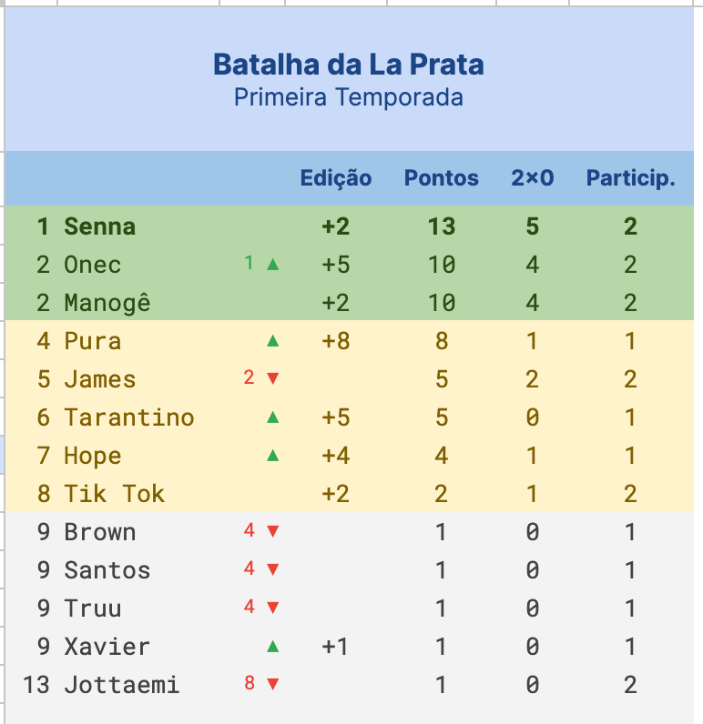

# Leaderboard Scripts

Code to automatically update a Google Sheet leaderboard that can be updated after every match. It's for a very specific type of competition, but with some effort you can change the rules to rank it however you want. Check where it is used for better understanding: [BDLP - Primeira Temporada 👺](https://docs.google.com/spreadsheets/d/1I52raoA1VmcaysQajV2qZWQrCePXAXODSpXu284lMMI/edit?usp=sharing).

## Screenshots

Click here:

To generate this (without styling):

## Dev

Run `clasp push --watch`.